# Auto Doc AI

Synthetic vehicle title document generator for training OCR, LayoutLMv3, and document understanding models. Produces realistic front + back title documents as SVG → PNG with pixel-accurate annotations in multiple formats.

## Sample Output

Generated documents span all 50 US states with randomized layouts, fonts, colors, and ornate security patterns.

**Front pages** — bordered, with state seal watermarks and security text:

<p float="left">
  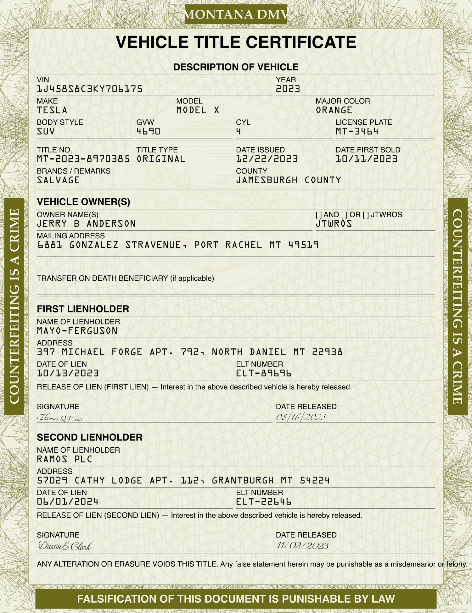
  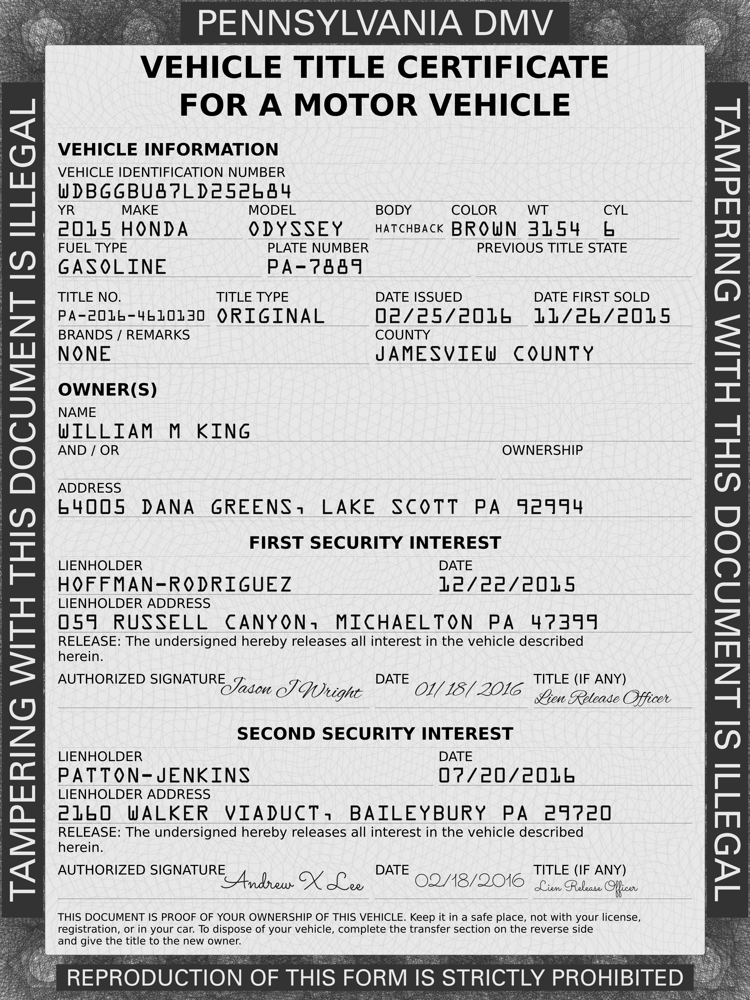
  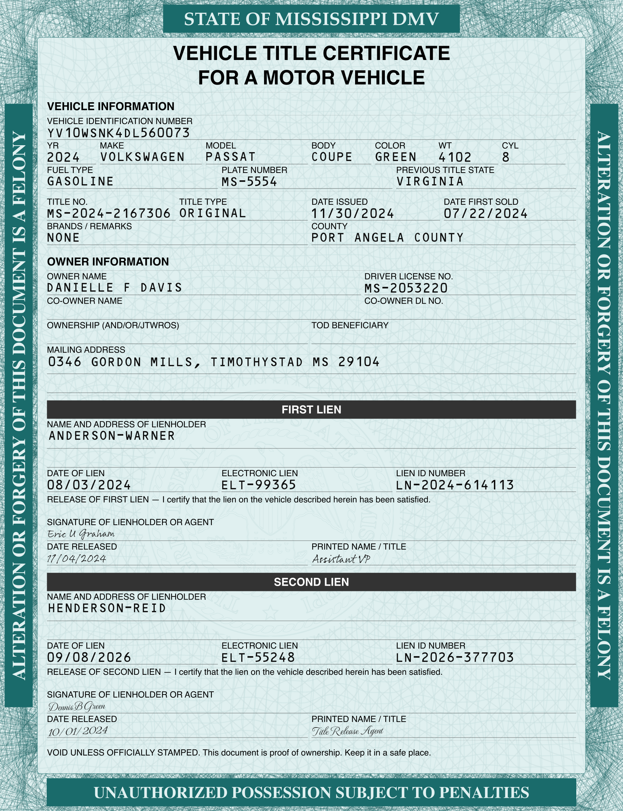
  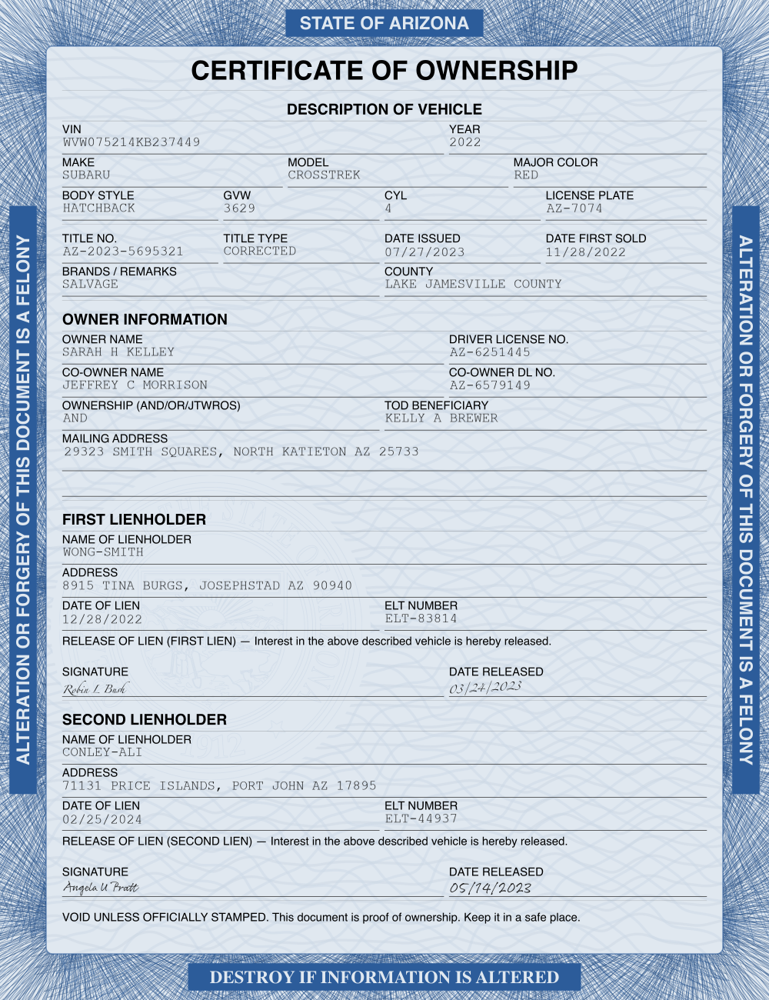
</p>

**Back pages** — transfer, dealer reassignment, notary, damage disclosure, and more:

<p float="left">
  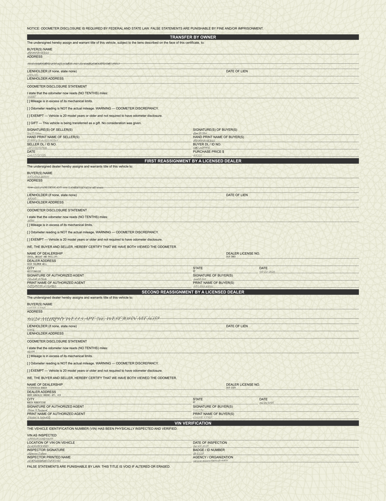
  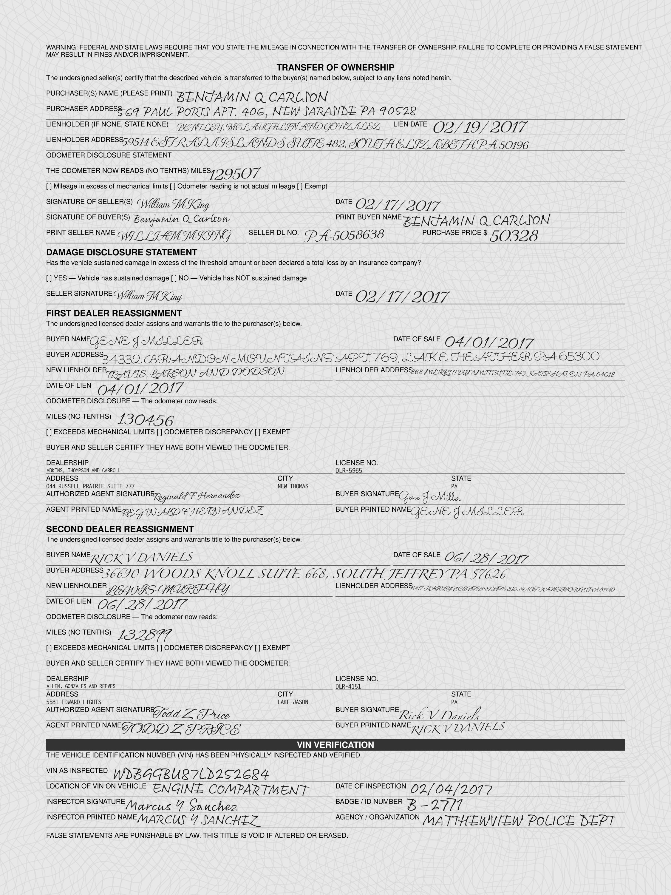
  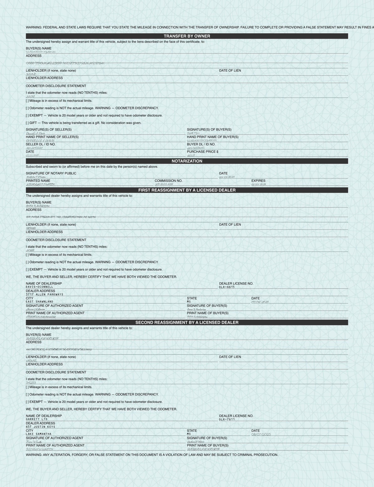
  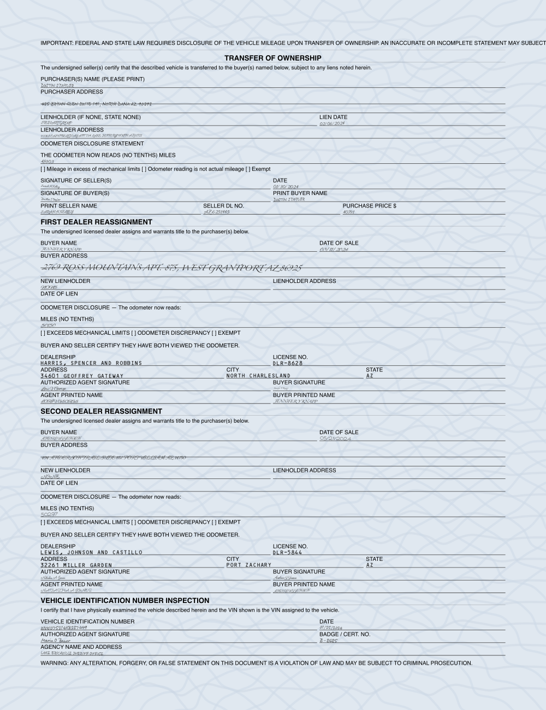
</p>

**Augmented versions** simulate camera capture (noise, blur, perspective distortion, JPEG artifacts):

<p float="left">
  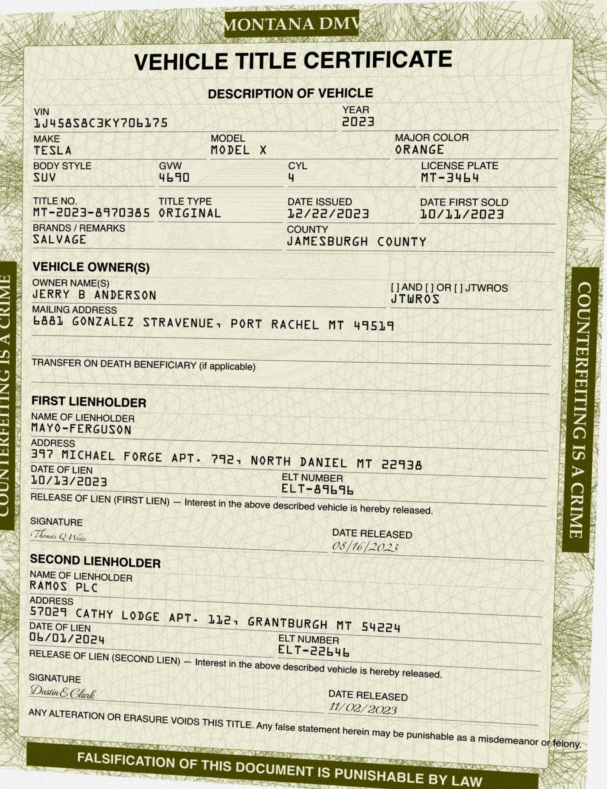
  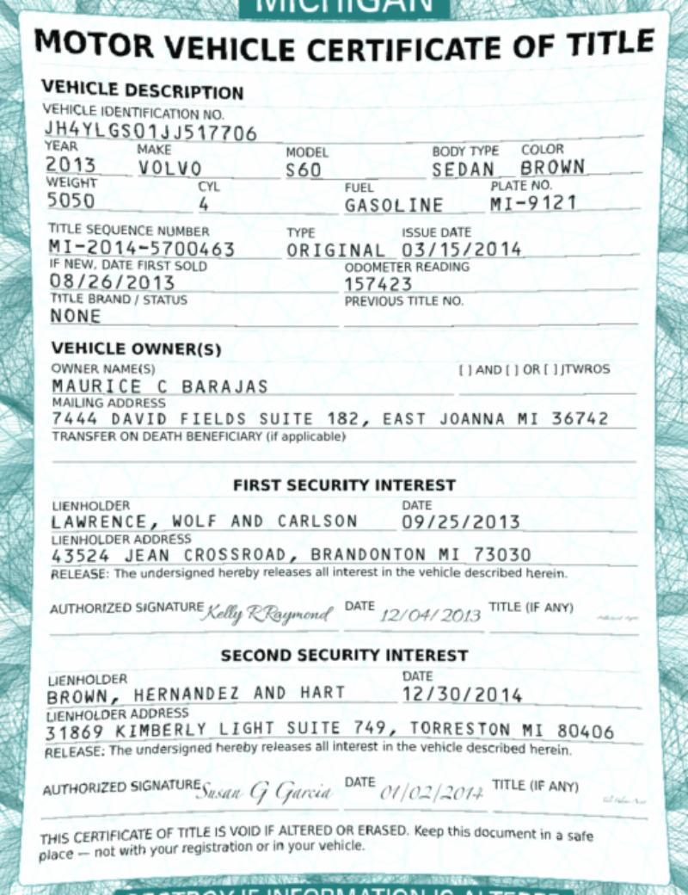
  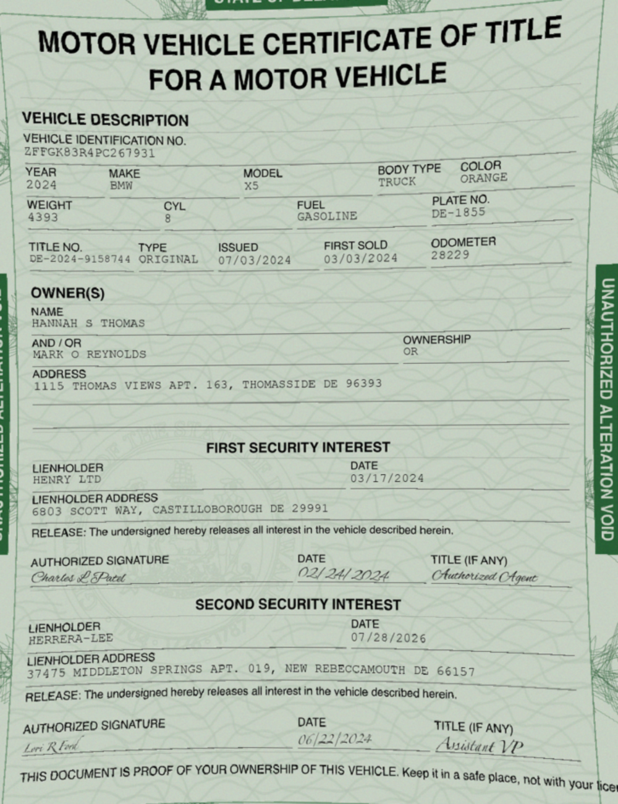
</p>

## Quick Start

### Requirements

- Python 3.12+
- `rsvg-convert` (for SVG → PNG rasterization): `brew install librsvg` on macOS

### Installation

```bash
git clone <repo-url> && cd auto_doc_ai
uv sync   # or: pip install -e .
uv pip install faker requests
```

### Generate a dataset

```bash
# 100 documents (front + back) with default augmentation
python generate_dataset.py --count 100 --output my_dataset/

# 10 clean documents (no augmentation), skip NHTSA API
python generate_dataset.py --count 10 --output clean_set/ --augment clean --no-api

# Heavy augmentation, fixed seed for reproducibility
python generate_dataset.py --count 500 --output train/ --augment heavy --seed 123
```

#### CLI Options

| Flag | Default | Description |
|------|---------|-------------|
| `--count` | 10 | Number of documents to generate |
| `--output` | `dataset/` | Output directory |
| `--size` | `random` | Page size: `small` (800x1040), `large` (2250x3000), or `random` |
| `--seed` | 42 | Base random seed |
| `--augment` | `default` | Augmentation preset: `clean`, `light`, `default`, `heavy` |
| `--no-api` | off | Skip NHTSA VIN decoder API, use synthetic vehicle data |

### Output Structure

```
my_dataset/
├── images/              # Augmented PNGs (training input)
├── images_clean/        # Clean PNGs (no augmentation)
├── annotations/         # Full annotations (words + fields + blocks)
├── layoutlm/            # LayoutLMv3-ready format
├── *.svg                # Source SVG vectors
└── *_meta.json          # Per-document metadata (values, state, vehicle, etc.)
```

Each document produces a front and back page: `title_0000_front.png`, `title_0000_back.png`, etc.

## Annotation Formats

### Full Annotations (`annotations/*.json`)

The richest format — three levels of granularity in one file:

```json
{
  "doc_id": "title_0000",
  "side": "front",
  "state": "Montana",
  "image_file": "images/title_0000_front.png",
  "augmentations": ["rotation", "perspective", "blur", "noise", "jpeg"],
  "annotations": {
    "words": [ ... ],
    "fields": [ ... ],
    "blocks": [ ... ]
  }
}
```

**Word level** — every word with pixel and normalized bounding boxes:
```json
{
  "text": "1J458S8C3KY706175",
  "bbox": [83.1, 287.4, 835.1, 328.1],
  "normalized_bbox": [55, 147, 556, 168],
  "category": "value",
  "field_name": "vin",
  "block_type": "vehicle_info",
  "field_type": "text"
}
```

**Field level** — label + value pairs with bboxes:
```json
{
  "field_name": "vin",
  "field_type": "text",
  "style": "underline",
  "block_type": "vehicle_info",
  "label": { "text": "VIN", "bbox": [...], "normalized_bbox": [...], "words": [...] },
  "value": { "text": "1J458S8C3KY706175", "bbox": [...], "normalized_bbox": [...], "words": [...] }
}
```

**Block level** — document sections (header, vehicle_info, owner, lien, transfer, etc.):
```json
{
  "block_type": "vehicle_info",
  "variant_id": "vehicle_v2",
  "bbox": [83.4, 242.1, 1389.5, 501.8],
  "fields": [ ... ]
}
```

### LayoutLMv3 Format (`layoutlm/*.json`)

Flat parallel arrays ready for tokenization:
```json
{
  "image_path": "images/title_0000_front.png",
  "width": 1500,
  "height": 1950,
  "words":  ["VEHICLE", "TITLE", "CERTIFICATE", "VIN", "1J458S8C3KY706175", ...],
  "bboxes": [[56,54,334,97], [334,54,543,97], [543,54,925,97], [55,131,557,149], ...],
  "labels": ["L_doc_title", "L_doc_title", "L_doc_title", "L_vin", "V_vin", ...]
}
```

- Bboxes normalized to 0–1000 range (LayoutLMv3 convention)
- Labels: `L_` prefix for printed labels, `V_` prefix for filled values, followed by `field_name`

### Per-Document Metadata (`*_meta.json`)

All generated field values, state, vehicle info, Faker seed — everything needed to recreate the document or use as ground truth.

## Loading Data for Training

### OCR Training

```python
import json
from pathlib import Path
from PIL import Image

dataset_dir = Path("my_dataset")

for ann_file in sorted(dataset_dir.glob("annotations/*.json")):
    with open(ann_file) as f:
        doc = json.load(f)

    img = Image.open(dataset_dir / doc["image_file"])

    for word in doc["annotations"]["words"]:
        text = word["text"]
        x1, y1, x2, y2 = word["bbox"]
        crop = img.crop((x1, y1, x2, y2))
        # feed (crop, text) pairs to your OCR model
```

### LayoutLMv3 Fine-Tuning

```python
import json
from pathlib import Path
from transformers import LayoutLMv3Processor

processor = LayoutLMv3Processor.from_pretrained("microsoft/layoutlmv3-base")
dataset_dir = Path("my_dataset")

samples = []
for lm_file in sorted(dataset_dir.glob("layoutlm/*.json")):
    with open(lm_file) as f:
        doc = json.load(f)

    image_path = dataset_dir / doc["image_path"]
    encoding = processor(
        images=Image.open(image_path),
        text=doc["words"],
        boxes=doc["bboxes"],
        word_labels=doc["labels"],  # map to label IDs as needed
        return_tensors="pt",
        truncation=True,
        padding="max_length",
    )
    samples.append(encoding)
```

### Key-Value Extraction

```python
import json

with open("my_dataset/annotations/title_0000_front.json") as f:
    doc = json.load(f)

for field in doc["annotations"]["fields"]:
    if field["value"] is None:
        continue  # label-only field (section headers, legal text)
    print(f"{field['label']['text']:30s} → {field['value']['text']}")
    # VIN                            → 1J458S8C3KY706175
    # YEAR                           → 2023
    # MAKE                           → TESLA
```

### HuggingFace Datasets

```python
import json
from pathlib import Path
from datasets import Dataset, Features, Sequence, Value, Image as HFImage

def load_layoutlm_dataset(dataset_dir: str) -> Dataset:
    dataset_dir = Path(dataset_dir)
    records = []
    for lm_file in sorted(dataset_dir.glob("layoutlm/*.json")):
        with open(lm_file) as f:
            doc = json.load(f)
        records.append({
            "image": str(dataset_dir / doc["image_path"]),
            "words": doc["words"],
            "bboxes": doc["bboxes"],
            "labels": doc["labels"],
        })
    return Dataset.from_list(records)

ds = load_layoutlm_dataset("my_dataset")
ds = ds.cast_column("image", HFImage())
print(ds)  # Dataset({ features: ['image', 'words', 'bboxes', 'labels'], num_rows: ... })
```

## Architecture

```
generate_dataset.py          # CLI entry point — orchestrates everything
│
├── src/document_layout/
│   ├── cells.py             # Block/field/row definitions, layout variants
│   ├── packing.py           # Font size solver, spatial placement
│   └── renderer.py          # SVG rendering, value population, metadata export
│
├── src/utils/
│   ├── augmentation.py      # Camera-capture simulation (noise, blur, perspective, etc.)
│   ├── annotation.py        # Multi-format annotation generation
│   ├── background_generation.py  # Ornate background patterns
│   ├── border_text.py       # Security warning text on borders
│   ├── state_insignia.py    # State seal watermarks
│   ├── handwriting.py       # Cursive text renderer (PIL → PNG → SVG embed)
│   └── machinewriting.py    # Typewriter/OCR font renderer
│
├── src/ornate_page/
│   ├── patterns.py          # 15 security pattern types (guilloche, spirograph, etc.)
│   └── composer.py          # Layer composition with SVG masks/clips
│
└── src/data/
    ├── static.py            # State list, security text strings
    ├── borders/             # 55 state border SVGs
    ├── insignias/           # 53 state seal SVGs
    ├── document_fonts/      # 6 body fonts (Arial, Helvetica, Frutiger, etc.)
    ├── machine_fonts/       # 9 OCR/typewriter fonts
    └── handwriting_fonts/   # 6 cursive fonts
```

### How Generation Works

1. **Faker** generates synthetic people, companies, and addresses tied to a random US state
2. **VIN generator** produces structurally valid VINs with correct check digits; optionally decoded via NHTSA API
3. **Layout engine** (`cells.py`) randomly selects block variants for front (header, vehicle info, owner, liens, legal) and back (transfer, dealer reassignment, notary, damage disclosure, etc.)
4. **Packing solver** (`packing.py`) binary-searches for the largest font size that fits all blocks, then computes exact placements
5. **Renderer** (`renderer.py`) draws SVG with ornate backgrounds, state seals, security patterns, and fills values using handwriting or machine fonts based on who would fill each field
6. **rsvg-convert** rasterizes SVG → clean PNG
7. **Augmentation** (`augmentation.py`) applies spatial transforms (rotation, perspective, barrel distortion) then pixel transforms (noise, blur, brightness, contrast, JPEG compression)
8. **Annotations** (`annotation.py`) builds word/field/block bboxes, transformed through the augmentation pipeline so they match the augmented image

### Document Fields (144 total)

**Front side** — DMV-printed document:
- Header (state name, document title)
- Vehicle info (VIN, year, make, model, body type, color, weight, cylinders, fuel type, plate number)
- Title metadata (title number, type, issue date, first sold, odometer, brands/remarks, county, previous title)
- Owner info (name, co-owner, ownership type, driver license, TOD beneficiary, address)
- First & second lien (lienholder name, address, date, ELT number, release signature)

**Back side** — filled by humans during transfers:
- Transfer of ownership (buyer/seller names, addresses, odometer, price, signatures)
- Odometer disclosure (mileage, mechanical limits, discrepancy checkboxes, exempt)
- Gift transfer checkbox
- Notary acknowledgment (notary name, seal, commission, witnesses)
- Damage disclosure statement
- First & second dealer reassignment (full dealer info, odometer, signatures)
- VIN verification/inspection block
- Power of attorney section
- Tax/fee calculation section

### Augmentation Pipeline

Spatial transforms (with bbox tracking):
- Slight rotation (±1.5°)
- Perspective distortion (simulates angled camera)
- Barrel distortion (fisheye effect)

Pixel transforms:
- Gaussian noise (sensor noise)
- Brightness/contrast shifts
- Gaussian blur (defocus)
- Resolution reduction (downscale → upscale)
- JPEG compression artifacts

Four presets: `clean` (none), `light`, `default`, `heavy`

### Handwriting vs Machine Text

The renderer classifies each field by who fills it:
- **Machine text** (OCR/typewriter fonts): All front-side fields, dealer business details on back
- **Handwriting** (cursive fonts): Signatures, back-side transfer fields, buyer/seller info, notary fields, VIN inspector fields

Each handwriting "person" (seller, buyer, dealer agent, notary, inspector) uses a consistent font throughout their fields, simulating real documents where one person fills multiple fields.

## Other Scripts

```bash
# Generate demo documents for visual inspection
python generate_demo.py

# Stress test: all 32 optional-section combinations × 2 sizes = 64 documents
python stress_test.py
```

## License

Apache 2.0
